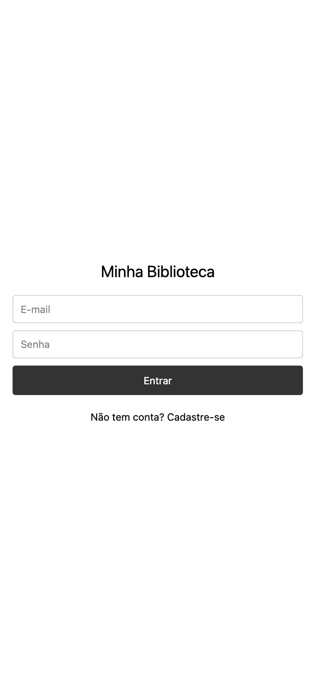
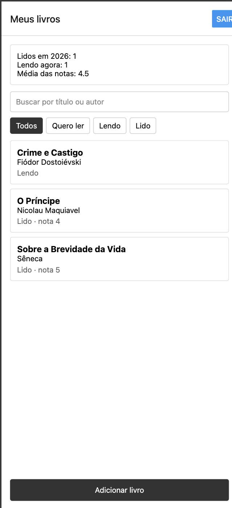
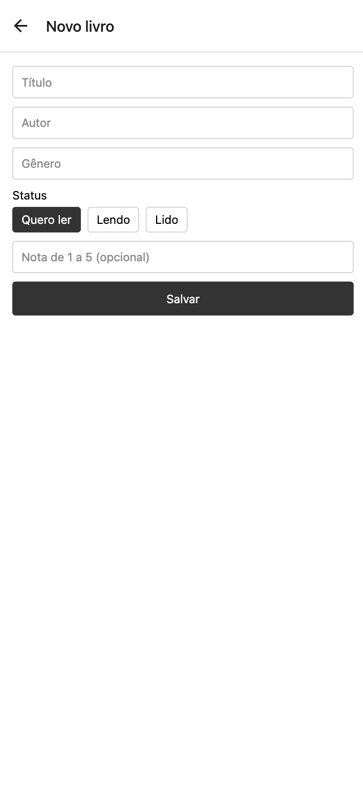

# Minha Biblioteca

App mobile para organizar uma biblioteca pessoal. Cada pessoa cria uma conta, cadastra os livros que quer ler, está lendo ou já leu, e acompanha quantos livros terminou no ano.

Trabalho final da disciplina Desafio de Desenvolvimento Mobile, feito com React Native, Expo e TypeScript.

## Funcionalidades

- Cadastro, login e saída com Firebase Authentication, com mensagens de erro em português
- Sessão salva no celular: ao reabrir o app, o usuário continua logado
- Telas internas só existem para quem está logado; ao sair, voltam as telas de login
- Cadastro, listagem, detalhes, edição e exclusão de livros (com confirmação antes de excluir)
- Lista atualizada em tempo real a partir do Firestore
- Busca por título ou autor e filtro por status
- Validação do formulário e mensagens de carregamento, erro e lista vazia
- Resumo da biblioteca: livros lidos no ano, livros sendo lidos e média das notas

## Regra de negócio

Um livro só tem data de conclusão quando está com o status **Lido**.

- Com status Lido, a data é obrigatória, precisa existir no calendário (31/02 é recusada) e não pode estar no futuro.
- Com qualquer outro status, o campo de data não aparece e nenhuma data é salva. Se uma data tinha sido digitada antes de trocar o status, ela é descartada.
- O resultado aparece no resumo da tela de lista: **"Lidos em (ano)"** conta os livros com status Lido cuja data de conclusão é do ano atual.
- A média das notas considera só os livros que têm nota. Se nenhum tiver, o resumo mostra "sem notas".

## Modelo dos registros

Cada livro fica em `users/{uid}/livros/{id}` no Cloud Firestore.

| Campo | Tipo | Observação |
|---|---|---|
| `titulo` | texto | obrigatório |
| `autor` | texto | obrigatório |
| `genero` | texto | obrigatório |
| `status` | `'Quero ler'`, `'Lendo'` ou `'Lido'` | obrigatório |
| `nota` | número de 1 a 5, ou `null` | opcional |
| `dataConclusao` | texto `AAAA-MM-DD`, ou `null` | só quando o status é Lido |

O `id` é o identificador do documento, gerado pelo Firestore.

## Serviços Firebase

- **Authentication**, com o método e-mail/senha
- **Cloud Firestore**, para guardar os livros

## Como rodar

Pré-requisitos: Node.js e o app Expo Go no celular.

1. Clone o repositório e instale as dependências:

   ```bash
   git clone https://github.com/brunosrtr/biblioteca-mobile.git
   cd biblioteca-mobile
   npm install
   ```

2. Crie um projeto no [console do Firebase](https://console.firebase.google.com/):
   - ative o **Authentication** com o método **E-mail/senha**;
   - crie um banco no **Firestore Database**;
   - em **Configurações do projeto → Seus apps**, registre um app da Web e copie os valores do `firebaseConfig`.

3. Copie o arquivo de exemplo e preencha com os valores do seu projeto:

   ```bash
   cp .env.example .env
   ```

   O `.env` está no `.gitignore` e não é enviado para o repositório.

4. Publique as regras do Firestore (seção abaixo).

5. Inicie o app e escaneie o QR code com o celular:

   ```bash
   npx expo start
   ```

## Regras do Firestore

As regras também estão no arquivo [`firestore.rules`](firestore.rules). Copie o conteúdo para **Firestore Database → Regras** no console e publique.

```
rules_version = '2';
service cloud.firestore {
  match /databases/{database}/documents {
    match /users/{userId}/{document=**} {
      allow read, write: if request.auth != null && request.auth.uid == userId;
    }
  }
}
```

Cada usuário só consegue ler e alterar os documentos dentro de `users/{seu uid}`. Qualquer outro acesso é negado pelo servidor, mesmo que não venha pelo app.

## Organização do código

```
App.tsx                 navegação e controle da sessão
src/
  config/firebase.ts    inicialização do Firebase
  services/             acesso ao Authentication e ao Firestore
  screens/              telas
  components/           componentes reutilizáveis (Botao, Input, Chip, LivroCard, Resumo)
  types/                tipos do livro e da navegação
  utils/                funções de data, filtro e resumo
```

## Telas

| Login | Lista | Formulário | Detalhes |
|---|---|---|---|
|  |  |  |  |
